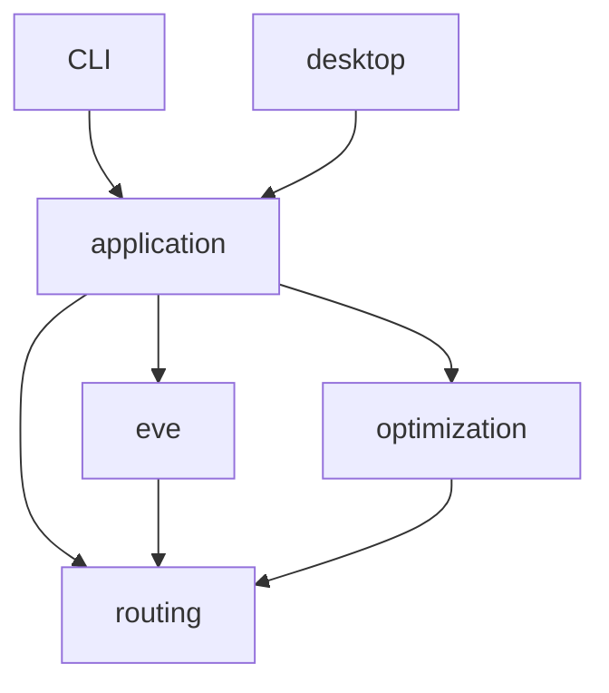

# Development

Install Python 3.12+ and an editable development environment:

```bash
python3.12 -m venv .venv
.venv/bin/python -m pip install -e ".[dev,browser]"
.venv/bin/python -m playwright install chromium
```

## Find the code

Start with [`CourierPlanner`](src/eve_courier_optimizer/application/planner.py) for the product
workflow and [`RouteOptimizer.solve`](src/eve_courier_optimizer/optimization/optimizer.py) for the
search. The CLI and desktop session both use the same planner.

| Package | Owns | Entry point |
| --- | --- | --- |
| `application` | Scan, plan, replan, arm and accepted-contract execution | `CourierPlanner` |
| `desktop` | Local HTTP API, browser assets, durable session and cancellable jobs | `server.py`, `PlanningSession` |
| `eve` | ESI/zKill observations, snapshot files, HTTP cache and SDE acquisition | `scan.py`, `esi.py`, `zkill.py` |
| `routing` | Permitted graph paths, problem preparation and independent route replay | `UniverseGraph`, `prepare_problem`, `simulate_and_verify` |
| `optimization` | Reward search, mathematical models, bounds and proof certificates | `RouteOptimizer`, `SolverConfig` |



`domain.py` contains the shared immutable contracts, observations, route requirements and results.
Routing has no network or solver dependency. Application and desktop code use the public optimizer
entry point; its selection loop, model constraints and route checks stay inside `optimization`.
Tests mirror these packages, and `tests/test_architecture.py` enforces their dependency boundaries.

`RouteOptimizer` first builds a verified route, then runs `ContractSelectionSearch`. That search owns
its incumbent, bounds, learned conflicts and budget. Its `SystemRelaxationMaster` proposes contract
sets; exact route checks validate them. Any remaining proof gap proceeds to `EventModel` with the
accumulated evidence. Route replay stays independent from all these search implementations.

The desktop UI targets windows at least 1024 pixels wide. Python serves its native JavaScript modules
and static assets directly; there is no frontend build system.

## Validate

```bash
.venv/bin/ruff check src tools tests benchmarks browser_tests
.venv/bin/ruff format --check src tools tests benchmarks browser_tests
.venv/bin/mypy src tools tests benchmarks browser_tests
.venv/bin/pytest
.venv/bin/pytest browser_tests --no-cov --browser chromium --tracing retain-on-failure
.venv/bin/python -m benchmarks.run_frozen --time-limit 10
.venv/bin/python -m benchmarks.run_empire --time-limit 60 --workers 4
.venv/bin/python -m pip wheel . --no-deps -w dist
```

Tests enforce at least 85% branch-inclusive coverage, including spawned workers. Browser tests use
synthetic local responses and exercise scanning, ranking, solving, arming, persistence, infeasible
recovery, cancellation and asynchronous autocomplete. No frontend compiler or runtime dependency
is needed beyond the browser. Live-network tests must remain opt-in.

For solver or preprocessing changes, follow [benchmark methodology](docs/BENCHMARKS.md). Protect
small hand-checkable optima and feasibility boundaries as well as representative workloads.
Keep generated benchmark results, diagnostic dumps and validation logs out of commits.
A safe reduction needs a mathematical reason it cannot remove an optimum. Heuristic caps must
remain explicit and mark proof scope. An infeasible core needs an actual infeasibility proof; a
relaxation incumbent must never be reported as a reward ceiling.

Keep independent verification independent: do not share solver state propagation or production
search with the reference implementation. New mathematical inputs belong in the problem fingerprint
and persisted model. Preserve accepted-state compatibility when modifying artifact schemas.

[Domain rules](docs/DOMAIN.md), [optimization](docs/OPTIMIZATION.md), and
[interfaces](docs/INTERFACES.md) document the non-obvious contracts. Keep explanations there concise;
source code should reveal ordinary control flow. See [SECURITY.md](SECURITY.md) and
[third-party notices](THIRD_PARTY_NOTICES.md) before publishing data or changing integrations.
