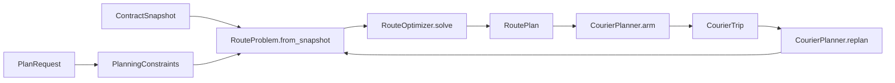

# Development

Install Python 3.12+ and an editable development environment:

```bash
python3.12 -m venv .venv
.venv/bin/python -m pip install -e ".[dev,browser]"
.venv/bin/python -m playwright install chromium
```

## Find the code

The two entry points are [`cli.py`](src/eve_courier_optimizer/cli.py) and
[`web/server.py`](src/eve_courier_optimizer/web/server.py). Both reach
[`CourierPlanner`](src/eve_courier_optimizer/application/planner.py) for solving and replanning.

| Responsibility | Code to read |
| --- | --- |
| Browser input, saved session, responses | `web/requests.py`, `web/workspace.py`, `web/responses.py` |
| Accepted contracts and real pickup/delivery progress | `application/courier_trip.py`: `CourierTrip` |
| ESI/zKill observations and CCP universe data | `eve/contract_scan.py`, `eve/esi.py`, `eve/zkill.py`, `eve/sde_build.py` |
| Permitted stargate paths and eligible contracts | `routing/universe.py`, `routing/security.py`, `routing/route_problem.py` |
| Solver workflow and budgets | `optimization/optimizer.py`, `optimization/solver_config.py` |
| Mathematical variables, objective and constraints | `optimization/models/`: pickup/delivery, system tour, selection bounds |
| Incumbent construction and exact selection searches | `optimization/search/` |
| Independent feasibility and small-instance optimality checks | `verification/route_replay.py`, `verification/exhaustive_optimum.py` |



`domain.py` defines shared immutable contracts, observations, constraints and results. `RouteProblem`
owns the eligible pool, mandatory shipments, distances and exclusion scope. The optimizer consumes
that problem; its models receive search hints explicitly. `CourierTrip` owns progress transitions,
while `trip_file.py` and `plan_file.py` own the versioned files. `PlanningWorkspace` saves the current
snapshot, proposed plan and trip for the local HTTP interface.

Models do not call search algorithms. Independent verification does not import the optimizer or
external clients. Tests enforce these dependency boundaries and follow the same package structure.
The browser uses native JavaScript modules served directly from `web/assets`; it targets desktop
windows at least 1024 pixels wide and has no frontend build step.

## Validate

```bash
.venv/bin/ruff check src tools tests benchmarks browser_tests
.venv/bin/ruff format --check src tools tests benchmarks browser_tests
.venv/bin/mypy src tools tests benchmarks browser_tests
.venv/bin/pyright --pythonpath .venv/bin/python
.venv/bin/pytest
.venv/bin/pytest browser_tests --no-cov --browser chromium --tracing retain-on-failure
.venv/bin/python -m benchmarks.run_frozen --time-limit 10
.venv/bin/python -m benchmarks.run_empire --time-limit 60 --workers 4
.venv/bin/python -m pip wheel . --no-deps -w dist
```

Tests enforce at least 85% branch-inclusive coverage, including spawned workers. Browser tests use
synthetic local responses and exercise scanning, ranking, solving, arming, persistence, infeasible
recovery, cancellation and asynchronous autocomplete. No frontend compiler or runtime dependency
is needed beyond the browser. Live-network tests must remain opt-in.

Pylance and the Pyright CLI share strict settings in `pyproject.toml`, covering source,
tools, tests and benchmarks. VS Code defaults to this repository's `.venv`; select that
interpreter explicitly if the workspace already remembers another one. Generated benchmark
results are excluded from type checking. Narrow comments document incomplete OR-Tools 9.15
stubs and intentional tests of private implementation details; do not disable diagnostic
categories across the project to hide new errors.

For solver or preprocessing changes, follow [benchmark methodology](docs/BENCHMARKS.md). Protect
small hand-checkable optima and feasibility boundaries as well as representative workloads.
Keep generated benchmark results, diagnostic dumps, validation logs and working experiment
reports out of commits. Store local research notes under the ignored `benchmarks/results/`
directory; maintain lasting solver contracts and benchmark methodology in `docs/`.
A safe reduction needs a mathematical reason it cannot remove an optimum. Heuristic caps must
remain explicit and mark proof scope. An infeasible core needs an actual infeasibility proof; a
relaxation incumbent must never be reported as a reward ceiling.

Keep independent verification independent: do not share solver state propagation or production
search with the exhaustive checker. New mathematical inputs belong in the problem fingerprint
and persisted model. Preserve accepted-state compatibility when modifying file schemas.

[Domain rules](docs/DOMAIN.md), [optimization](docs/OPTIMIZATION.md), and
[interfaces](docs/INTERFACES.md) document the non-obvious contracts. Keep explanations there concise;
source code should reveal ordinary control flow. See [SECURITY.md](SECURITY.md) and
[third-party notices](THIRD_PARTY_NOTICES.md) before publishing data or changing integrations.
