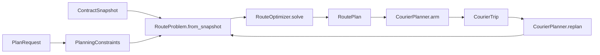

# Contributing

Useful contributions include clearer explanations, reproducible bug reports, UI improvements and
solver changes backed by evidence. You do not need to understand the mathematics to help with
documentation or the browser workflow.

## Choose a starting point

- **Report a bug:** use the repository's [bug report form](https://github.com/Pascal-Rat/Eve-Online_Routes_Optimizer/issues/new?template=bug_report.yml).
  Include what you expected, what happened, steps to reproduce it, and the application version.
  A small synthetic example is especially useful for route or proof errors.
- **Improve an explanation:** describe which term, instruction or result was confusing and suggest
  wording that would have helped. Keep detailed rules in the relevant guide and link to them.
- **Change behavior:** explain the concrete use case. For a substantial solver or architecture
  change, describe the proposal in an issue before investing in a large implementation.

Remove private route data from shared examples. Report security vulnerabilities through the
[security policy](SECURITY.md).

## Set up a development environment

Get the source and install Python 3.12+ using the [README setup steps](README.md#run-it-locally).
From the repository root, install an editable environment so source changes take effect directly:

```bash
python3.12 -m venv .venv
.venv/bin/python -m pip install -e ".[dev,browser]"
.venv/bin/python -m playwright install chromium
```

The `dev` extra installs lint, typing and test tools; `browser` adds the browser test integration.
Playwright installs Chromium for those tests. On Windows, create the environment with
`py -3.12 -m venv .venv`, then replace `.venv/bin/` with `.\.venv\Scripts\` in the commands and add
`.exe` to executable names, as shown in the README.

## Find the code

The two entry points are [`cli.py`](src/eve_courier_optimizer/cli.py) and
[`web/server.py`](src/eve_courier_optimizer/web/server.py). Both reach
[`CourierPlanner`](src/eve_courier_optimizer/application/planner.py) for solving and replanning.

| Responsibility | Code to read |
| --- | --- |
| Browser input, saved session, responses | `web/requests.py`, `web/workspace.py`, `web/responses.py` |
| Accepted contracts and real pickup/delivery progress | `application/courier_trip.py`: `CourierTrip` |
| ESI/zKill observations and CCP universe data | `eve/contract_scan.py`, `eve/esi.py`, `eve/zkill.py`, `eve/sde_build.py` |
| Permitted stargate paths and eligible contracts | `routing/universe.py`, `routing/security.py`, `routing/route_problem.py` |
| Solver workflow and budgets | `optimization/optimizer.py`, `optimization/solver_config.py` |
| Mathematical variables, objective and constraints | `optimization/models/`: pickup/delivery, system tour, selection bounds |
| Incumbent construction and exact selection searches | `optimization/search/` |
| Independent feasibility and small-instance optimality checks | `verification/route_replay.py`, `verification/exhaustive_optimum.py` |



`domain.py` defines shared immutable contracts, observations, constraints and results. `RouteProblem`
owns the eligible pool, mandatory shipments, distances and exclusion scope. The optimizer consumes
that problem; its models receive search hints explicitly. `CourierTrip` owns progress transitions,
while `trip_file.py` and `plan_file.py` own the versioned files. `PlanningWorkspace` saves the current
snapshot, proposed plan and trip for the local HTTP interface.

Models do not call search algorithms. Independent verification does not import the optimizer or
external clients. Tests enforce these dependency boundaries and follow the same package structure.
The browser uses native JavaScript modules served directly from `web/assets`; it targets desktop
windows at least 1024 pixels wide and has no frontend build step.

## Validate your change

For documentation changes, check the rendered Markdown, local links and example commands. For
behavior changes, run the relevant tests first, then the checks affected by the change. The full
validation sequence is:

```bash
.venv/bin/ruff check src tools tests benchmarks browser_tests
.venv/bin/ruff format --check src tools tests benchmarks browser_tests
.venv/bin/mypy src tools tests benchmarks browser_tests
.venv/bin/pyright --pythonpath .venv/bin/python
npm ci --ignore-scripts
.venv/bin/python tools/generate_web_contracts.py --check
npm run check
npm test
.venv/bin/pytest
.venv/bin/pytest browser_tests --no-cov --browser chromium --tracing retain-on-failure
.venv/bin/python -m benchmarks.run_frozen --time-limit 10
.venv/bin/python -m benchmarks.run_empire --time-limit 60 --workers 4
.venv/bin/python -m pip install build
.venv/bin/python -m build
.venv/bin/python tools/check_release.py
```

Tests enforce at least 85% branch-inclusive coverage, including spawned workers. Browser tests use
synthetic local responses and exercise scanning, ranking, solving, arming, persistence, infeasible
recovery, cancellation, stale tabs, policy application and asynchronous autocomplete. Node.js 24
and the pinned TypeScript development dependency check all six native JavaScript modules; no
compilation or Node runtime is needed to use the application. Python response contracts and HTML
IDs generate the browser declarations and validators: after changing them, run
`python tools/generate_web_contracts.py` and commit the generated files. Live-network tests remain
opt-in.

Release tags must exactly match the source version. The release workflow runs the same-commit CI,
builds once, validates wheel/sdist versions and records SHA-256 hashes. Installed-wheel smoke jobs
cover Linux Python 3.12 and 3.13, Windows 3.12 and macOS 3.12. Publication depends on every check and
uses those same artifacts. To smoke-test locally, install the wheel into a separate virtual
environment, then run `tools/smoke_installed.py --manifest dist/release-manifest.json` with that
environment's interpreter; it rejects an import from checkout sources.

Pylance and the Pyright CLI share strict settings in `pyproject.toml`, covering source,
tools, tests and benchmarks. VS Code defaults to this repository's `.venv`; select that
interpreter explicitly if the workspace already remembers another one. Generated benchmark
results are excluded from type checking. Narrow comments document incomplete OR-Tools 9.15
stubs and intentional tests of private implementation details; do not disable diagnostic
categories across the project to hide new errors.

## Changing solver behavior

For solver or preprocessing changes, follow [benchmark methodology](docs/BENCHMARKS.md). Protect
small hand-checkable optima and feasibility boundaries as well as representative workloads.
Keep generated benchmark results, diagnostic dumps and validation logs out of commits.
Maintain lasting solver contracts and benchmark methodology in `docs/`.
A safe reduction needs a mathematical reason it cannot remove an optimum. Heuristic caps must
remain explicit and mark proof scope. An infeasible core needs an actual infeasibility proof; a
relaxation incumbent must never be reported as a reward ceiling.

Keep independent verification independent: do not share solver state propagation or production
search with the exhaustive checker. New mathematical inputs belong in the problem fingerprint
and persisted model. Preserve accepted-state compatibility when modifying file schemas.

## Refreshing the bundled map data

Normal use needs no separate SDE download. To update the bundled subset from CCP's Static Data
Export during development:

```bash
.venv/bin/python tools/build_sde.py
.venv/bin/eve-courier sde-info
```

Inspect the build identity and rerun validation after the update. A contract snapshot and route
graph must use the same SDE build. Back up active workspaces before changing it; the web app
retains old scan metadata so a refreshed replan can acquire matching data without dropping accepted
shipments. Required endpoints must still exist in the new graph. The frozen Empire
benchmark carries its own map data and must keep its existing mathematical input.

## Keep the documentation useful

[Domain rules](docs/DOMAIN.md), [optimization](docs/OPTIMIZATION.md), and
[interfaces](docs/INTERFACES.md) document the non-obvious contracts. Keep explanations there concise;
source code should reveal ordinary control flow. See [SECURITY.md](SECURITY.md) and
[third-party notices](THIRD_PARTY_NOTICES.md) before publishing data or changing integrations.
