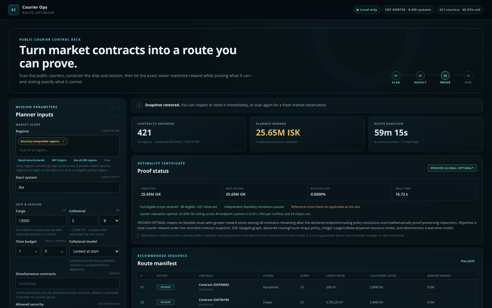
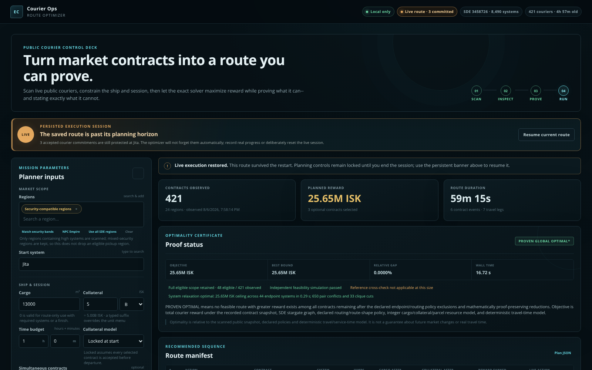

# EVE Courier Route Optimizer

[](https://github.com/Pascal-Rat/eve-courier-route-optimizer/actions/workflows/ci.yml)
[](https://www.python.org/)
[](LICENSE)

**Find the highest-reward sequence of public EVE Online courier contracts that your ship can
actually carry, route it gate by gate, avoid the threats you care about, and know when the result is
mathematically proven optimal.**

The application runs entirely on your computer. Its local web control deck handles market
acquisition, route constraints, opportunity inspection, exact optimization, proof diagnostics and
live execution without requiring EVE login credentials.



## Why this exists

A courier contract can look mediocre on its own and still be valuable inside a cluster of nearby
pickups and deliveries. Conversely, a high-reward contract can destroy an otherwise excellent route
once repositioning, capacity, collateral, deadlines, security restrictions or a return trip are
counted.

This project solves the combined problem. It does not simply sort contracts by ISK per hour and
chain them greedily. OR-Tools CP-SAT chooses the contracts and their interleaved pickup/delivery
order together.

| Capability | What it means |
| --- | --- |
| Live public-contract scan | Pull courier opportunities from selected, security-compatible, NPC Empire, or all SDE regions |
| Exact route optimization | Jointly choose contracts, pickup order, delivery order, required waypoints and terminal route |
| Optimality certificate | Report incumbent reward, rigorous upper bound and remaining proof gap instead of calling a timeout "optimal" |
| Gate-aware routing | Return the actual named stargate path, not just a list of contract endpoints |
| Optional gank awareness | Build hard route avoids from recent gate-focused zKill evidence by threat category |
| Real cargo constraints | Enforce volume, collateral mode, deadlines and an optional simultaneous-parcel limit |
| Flexible route shape | Loop by default, or require systems and an optional fixed destination |
| Persistent execution | Preserve accepted commitments across restarts and replan from real pickups and deliveries |

## Quick start

Requirements are Python 3.12+ and internet access for live ESI/zKill scans. The repository already
contains the distilled routing SDE, so normal installation does not download CCP's full SDE.

```bash
git clone https://github.com/Pascal-Rat/eve-courier-route-optimizer.git
cd eve-courier-route-optimizer

python3.12 -m venv .venv
.venv/bin/python -m pip install -e .
.venv/bin/eve-courier web
```

The browser opens at `http://127.0.0.1:8765/`. The server binds to IPv4 loopback only. Use
`eve-courier web --no-browser` to start it without opening a tab.

No OAuth client ID, client secret, character login or access token is needed for the public-data
workflow.

## From market scan to flown route

1. **Scan** public courier contracts. Search individual regions or use a proof-safe preset such as
   NPC Empire or security-compatible regions.
2. **Configure** cargo, collateral, session length, high/low/null security bands, route shape,
   required systems, simultaneous parcels and optional gank-awareness categories.
3. **Inspect** the standalone opportunity ranking when useful. This is a directional view, not a
   restriction on the optimizer.
4. **Solve** the full pickup-and-delivery problem. Read the reward, upper bound, proof gap and
   independent verification checks.
5. **Fly** the named gate-by-gate route. Arm execution only after accepting the selected locked-mode
   contracts in EVE, then record pickups, deliveries and required waypoints.
6. **Replan** against a fresh market observation while already accepted commitments remain
   mandatory.

Collateral fields accept exact ISK and `K`, `M` or `B` suffixes such as `750M`, `1.5B` and
`10B`. Time is entered as separate hours and minutes. System and region fields use searchable
autocomplete controls.

### Execution survives restarts on purpose

Accepted courier commitments must not disappear because a browser tab or the program closed. Live
execution is persisted to disk and restored on the next launch.

When that happens, a persistent **Live route** indicator and execution banner explain why fresh
Scan, Rank and Solve controls are locked. **Resume current route** takes you back to the live
itinerary. If no accepted commitments remain, **End execution** safely releases the planning lock.
If commitments still exist, the advanced reset remains available but requires deliberate
confirmation because it tells the optimizer to stop protecting those in-game obligations.



## What "proven optimal" means

The optimization target is gross courier reward. For a fixed snapshot and declared constraints, the
solver searches for a feasible route with reward `R` while CP-SAT maintains a rigorous best
possible upper bound `U`.

- If `R = U`, the result is `proven_optimal`.
- If the time limit expires with `R < U`, the result is `feasible_not_proven` and the gap is
  reported.
- If the full model is proven impossible, the result is `proven_infeasible`.

Dense cases get a proof-guided decomposition phase. Resource-aware pair incompatibilities and clique
cuts strengthen an endpoint-system master problem. When that master is solved optimally, its chosen
contracts are routed in a reduced copy of the exact pickup/dropoff model. If the verified exact route
reaches the master ceiling, the two bounds meet and the global reward proof is complete without a
monolithic 96-contract event search. If the chosen set is exactly infeasible, a rigorously proven
assumption core becomes a higher-order master cut. Unresolved cases still fall back to the complete
exact CP-SAT model.

Every feasible route is independently simulated after CP-SAT extraction. The verifier recomputes
travel, route-policy compliance, pickup-before-delivery precedence, cargo, collateral, parcel count,
deadlines, required systems and terminal travel without trusting the solver's internal resource
variables.

Read [Optimality and proof scope](docs/OPTIMALITY.md) and the
[mathematical model](docs/MATHEMATICAL_MODEL.md) before treating a certificate as a real-world
guarantee. Live ESI pagination is not a transactional market snapshot, and a proof cannot include a
contract that did not exist in the recorded observation.

### Frozen NPC Empire benchmark

The repository ships the frozen real-market observation used for repeatable solver work. Both
profiles are one-hour loops from Jita with gate-threat filtering and no candidate truncation.

| Profile | Eligible | Best route | Rigorous bound | Gap | Recorded wall time |
| --- | ---: | ---: | ---: | ---: | ---: |
| BR, 13,000 m3, 5B collateral, high+low | 48 | 25.651527M ISK | 25.651527M ISK | **0%, proven** | 0.614 s |
| DST, 62,500 m3, 10B collateral, high | 96 | 58.000000M ISK | 58.000000M ISK | **0%, proven** | 7.769 s |

The v1.5 DST proof closes in one master/exact iteration: five master-selected contracts form an
independently verified 58M route, exactly matching the 58M system-master optimum. The configured
60-second full-route fallback is therefore never entered. These times are frozen regression
observations from this environment, not promises about another CPU or a future live market.

See [benchmarks](docs/BENCHMARKS.md) for reproducibility and
[live benchmark notes](docs/LIVE_BENCHMARKS.md) for the acquisition/performance experiments.

## Gank-aware routing

Threat awareness is deliberately gate-focused. Recent zKill killmail evidence contributes route
danger only when it is player-caused PvP and is located at a known SDE stargate or within the chosen
gate radius. Pure NPC/CONCORD losses and kills away from gates are not treated as courier gate
danger.

The UI can independently avoid:

- suicide ganks;
- smartbomb kills;
- heavy interdictors;
- carriers;
- multi-pilot gate camps;
- hauler losses; and
- any qualifying gate PvP.

Threat-matched systems become routing exclusions, so the solver cannot quietly pass through a
dangerous transit system on the way to a safe pickup. Missing reachable threat-intel coverage
invalidates a threat-aware proof instead of being interpreted as "safe."

This is a transparent routing policy, not a claim that an allowed system is safe. Historical
killmails cannot predict the future.

See [Gate threat model](docs/GATE_THREAT_MODEL.md).

## Route policies

The web UI supports every non-empty combination of high, low and null security space. CCP route
logic classifies high security from raw SDE security `>= 0.45`, which corresponds to the familiar
0.5+ value shown in the EVE client.

Routes return to the start by default. You can instead:

- make the route open;
- require one or more systems to be visited at least once;
- require an open route to finish in a specific system;
- exclude arbitrary systems;
- limit picked-but-not-yet-delivered contracts independently of cargo volume; or
- use zero cargo with required waypoints/destination to turn the optimizer into a pure route finder.

Required systems participate in optimization. They are not inserted after solving.

## CLI

The web UI is the recommended operator interface, but every core workflow is also scriptable.

```bash
# Scan
.venv/bin/eve-courier scan --region "The Forge" --region "The Citadel" --output contracts.json

# Inspect standalone opportunities
.venv/bin/eve-courier rank \
  --snapshot contracts.json --start Jita \
  --cargo-m3 62500 --collateral-isk 10B --hours 1 --limit 20

# Exact one-hour high-sec loop
.venv/bin/eve-courier solve \
  --snapshot contracts.json --output plan.json \
  --start Jita --cargo-m3 62500 --collateral-isk 10B --hours 1 \
  --security highsec --loop --time-limit 300 --workers 4
```

Run `eve-courier COMMAND --help` for the complete options. Live execution and replanning also have
CLI commands; see [Live replanning](docs/LIVE_REPLANNING.md).

## Architecture and documentation

The core is intentionally layered so acquisition, mathematical reasoning, persistence and
presentation do not become one opaque solver script.

- [Technical overview and end-to-end diagram](docs/TECHNICAL_OVERVIEW.md)
- [Architecture](docs/ARCHITECTURE.md)
- [CP-SAT and OR-Tools guide](docs/CP_SAT_GUIDE.md)
- [Mathematical model](docs/MATHEMATICAL_MODEL.md)
- [Optimality and proof scope](docs/OPTIMALITY.md)
- [ESI and SDE](docs/ESI_SDE.md)
- [Gate threat model](docs/GATE_THREAT_MODEL.md)
- [Local web UI](docs/WEB_UI.md)
- [JSON formats](docs/JSON_FORMATS.md)
- [Benchmark methodology](docs/BENCHMARKS.md)

## Contributing

Contributions are welcome, especially around exact proof performance, route modelling, data
acquisition and operator UX. Proof-sensitive changes have a higher bar than ordinary UI changes:
safe preprocessing needs a mathematical reason it cannot remove the optimum, and changes to
feasibility or bounds need regression tests.

```bash
python3.12 -m venv .venv
.venv/bin/python -m pip install -e ".[dev]"
.venv/bin/ruff check src tools tests benchmarks
.venv/bin/mypy src tools tests benchmarks
.venv/bin/pytest
PYTHONPATH=src .venv/bin/python -m benchmarks.run_frozen --time-limit 10
```

CI enforces strict Mypy, Ruff, branch-aware test coverage of at least 85%, the frozen proof
regression and a wheel build. See [CONTRIBUTING.md](CONTRIBUTING.md), [SECURITY.md](SECURITY.md) and
[CHANGELOG.md](CHANGELOG.md).

## Data, privacy and EVE policy

- The normal public-contract workflow uses public ESI data and needs no character authentication.
- Runtime snapshots, plans and execution state are ignored by Git because they can reveal current
  routes or contract activity.
- The localhost UI is not designed to be exposed directly to the public internet.
- The bundled route database is distilled from CCP's Static Data Export and can be rebuilt with
  `.venv/bin/python tools/build_sde.py`.

Project-owned code is MIT licensed. EVE Online, CCP trademarks, ESI data and SDE material remain
subject to CCP's terms. See [THIRD_PARTY_NOTICES.md](THIRD_PARTY_NOTICES.md) and the
[CCP Developer License Agreement](https://developers.eveonline.com/license-agreement).

## License

[MIT](LICENSE) for project-owned source code and documentation.

EVE Online and all related trademarks and game data belong to their respective owners. This is an
independent third-party project and is not affiliated with or endorsed by CCP Games.
