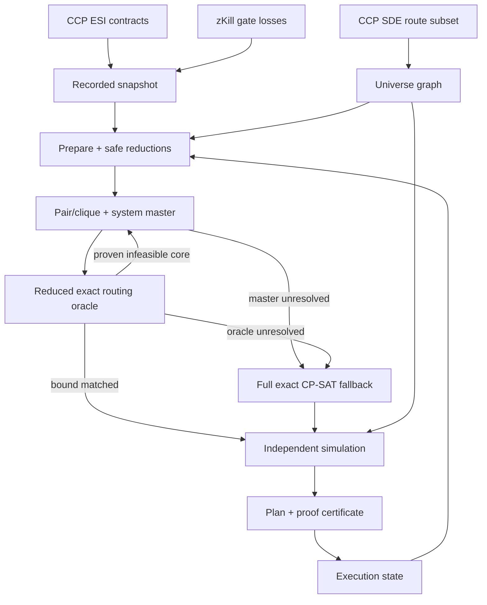

# Architecture

For the contributor-facing end-to-end diagram that includes acquisition scopes, threat collection,
ranking, proof, pilot routing and live replanning, start with
[TECHNICAL_OVERVIEW.md](TECHNICAL_OVERVIEW.md).

## Design goals

V1 is built around five non-negotiable properties:

1. **Reproducible inputs.** A solve consumes a serialized contract observation plus an identified SDE
   build instead of querying a moving market from inside the optimizer.
2. **Exact resource arithmetic.** Cargo and money are integers before the solver sees them.
3. **Explicit policy.** Unsupported endpoints and security restrictions are visible exclusions, not
   silent solver shortcuts.
4. **Proof honesty.** Heuristic truncation is recorded and prevents a full-scope optimality claim.
5. **Independent verification.** A solver route must pass a second implementation of route/resource
   semantics before it is reported.

## Data flow

The scan and solve phases are deliberately separate. A scan can be archived, inspected, solved with
different constraints, and hashed. A later scan is a new observation rather than an invisible
mutation of the old optimization problem.

## Modules

| Module | Responsibility |
| --- | --- |
| `domain.py` | immutable domain records, route shape/parcel constraints, security policy, human ISK parsing, exact unit conversion and validation |
| `esi.py` | public ESI HTTP, pagination, conditional cache, retries/rate-limit behavior |
| `scanner.py` | bounded-concurrent ESI region scan and separate threat scope to a deterministic `ContractSnapshot` |
| `threat_intel.py` | polite zKill ingestion, SDE gate localization, category classification and hard-avoid derivation |
| `snapshot.py` | versioned JSON snapshot serialization |
| `sde_build.py` | reproducible extraction of the routing subset from CCP's JSONL SDE |
| `sde.py` | read-only route DB, security policy, exact BFS jump counts and paths |
| `planning.py` | policy exclusions, proof-preserving reductions, profitability ranking |
| `bounds.py` | resource-aware pair incompatibilities, clique cuts, reusable endpoint-system master and learned no-good encoding |
| `solver.py` | logic-based master/exact decomposition plus the full prize-collecting pickup/delivery CP-SAT fallback |
| `reference_solver.py` | independent exhaustive oracle for small locked-mode instances |
| `verification.py` | post-solve simulation that does not trust CP-SAT state variables |
| `proof.py` | canonical problem fingerprint and scope-aware claim text |
| `reporting.py` | stable, versioned plan JSON shared by CLI and web UI |
| `execution.py` | persistent live commitments, original terminal/required-route state, parcel cap, and progress transitions |
| `service.py` | application boundary shared by the CLI and localhost UI |
| `webapp.py` | loopback-only HTTP/session boundary over `PlannerService` |
| `web/` | packaged HTML/CSS/JS control deck; presentation only, no constraint engine |
| `cli.py` | user-facing orchestration only; mathematical logic remains below it |

## Exact units

ESI JSON can represent decimal-looking values through floating-point numbers. The HTTP JSON parser
therefore creates `Decimal` values, and `domain.py` converts them once at the boundary:

- cargo demand: units of 0.001 m³, rounded **up**;
- ship cargo capacity: units of 0.001 m³, rounded **down**;
- ISK: centi-ISK integer units, rounded half-up to eliminate floating representation residue.

Demand-up/capacity-down is intentionally conservative. A borderline contract can be rejected by a
sub-milliliter representation artifact; the program will not manufacture a false cargo-feasible
proof by rounding demand down.

CP-SAT then sees only integers. The exact objective is read from the modeled integer variable rather
than CP-SAT's floating reporting value, including above the binary-float exact-integer range.

## Routing graph

The bundled SQLite database contains only what route optimization needs:

- region ID/name plus optional SDE faction owner for acquisition presets;
- solar-system ID/name/security status;
- NPC station -> solar-system mapping;
- normal stargate connections, item IDs, and three-dimensional positions;
- item type -> group mappings needed for deterministic threat categories; and
- SDE build/release/source metadata.

The application loads that roughly 3 MB subset into memory. For systems relevant to a prepared
problem it runs unweighted BFS under the declared security-band/manual-avoid/gate-threat policy,
producing exact minimum jump counts. Gate-threat awareness is therefore a deterministic graph filter,
not a second approximate path scorer. The CP model operates on the resulting metric closure rather
than one variable per gate.

Preparation first computes only the direct start-to-pickup and pickup-to-delivery lower bounds needed
for safe rejection. It builds the full relevant-system closure only after those reductions (and any
explicit heuristic cap), avoiding an unnecessary all-pairs expansion over discarded candidates.
Policy-specific closures and concrete paths use bounded in-memory caches to accelerate repeated
ranking/solving/replanning without allowing unbounded growth.

The same BFS graph provides a proof-safe acquisition optimization for threat intel. Before a web
scan, the application computes all systems within the maximum possible jump count from the start
under stable security/manual policy, before applying dynamic threat avoids. zKill then needs only the
regions intersecting that superset. A later hard avoid can only delete nodes, so it cannot create a
route into a region outside the pre-threat envelope. `planning.py` recomputes this envelope and
rejects a threat-aware proof if any required region lacks a successful observation.

`verification.py` separately reconstructs an actual shortest gate path for each chosen leg.
Those exact system-ID paths are persisted in the plan; the localhost layer decorates them with SDE
names/security status and renders the gate-by-gate pilot itinerary. It does not ask the browser or a
second route service to invent directions.

Required route systems are added to the relevant-system closure even when no courier contract uses
them. In CP-SAT they become mandatory zero-service event nodes. A loop/fixed finish gives the dummy
end a real terminal system, so final travel is charged through the same policy-filtered matrix. A
fully open route leaves the end systemless. This keeps route-only (`cargo = 0`) use on the exact same
routing/proof path as courier optimization.

## Solver boundary

`prepare_problem()` returns a `PreparedProblem` containing exactly two things the optimizer needs:

1. the immutable `RouteProblem`, and
2. the all-pairs relevant-system jump matrix.

The solver is intentionally unaware of HTTP, files, SDE parsing, or UI. This keeps the proof surface
small and makes it straightforward to test synthetic instances.

Reward is always the primary objective. Only after its optimum is **proven**, through either the
master/exact equality or the complete event model, may a bounded exact refinement minimize finish
time at that fixed reward. Failure to finish the refinement does not weaken the already-completed
reward proof; it merely means the returned reward-optimal route is not guaranteed to be the fastest
among reward-optimal routes.

For at least 20 optional contracts, `bounds.py` first derives valid pair/clique selection
constraints and solves a deliberately easier path over distinct endpoint systems. The relaxed model
keeps route time, service count, terminal shape and locked collateral while dropping global
pickup/delivery order and dynamic courier resources. Any exact route can be projected into this
easier model, so its CP-SAT objective bound is a rigorous ceiling on exact reward.

V1.5 also uses that relaxation as a master. Once its reward optimum is proven, `solver.py` sends the
master-selected contracts to a reduced copy of the exact event model. A verified exact route at the
same reward closes the global proof immediately because a feasible exact lower bound has met the
rigorous master upper bound. If the reduced exact model instead proves the selection infeasible,
positive CP-SAT assumptions yield a sufficient coexistence core. Optional-contract feasibility is
downward-closed under this metric-closure model, so the core safely adds
`sum(x_i for i in core) <= len(core) - 1` to the master and the loop may continue. An UNKNOWN
subproblem never creates a cut. The decomposition has a bounded wall-time envelope; unresolved
instances keep the final safe ceiling/core cuts and fall back to the complete event model.

The event-arc model omits transitions that cannot satisfy conservative earliest/latest time bounds.
Those bounds include the mandatory start -> pickup -> delivery shortest-path lower bound, and direct
same-contract arcs that structurally contradict pickup-before-delivery are never created. A simple
pickup-to-delivery minimum-time inequality and service-action cardinality inequality give CP-SAT
extra propagation without changing the feasible set. The complete event-route duration is also
written as one redundant global linear equality. A greedy sequential route supplies a solution
hint, but no candidate or arc is deleted merely because the hint did not use it. These optimizations
preserve CP-SAT's feasible set and proof semantics. See [CP_SAT_GUIDE.md](CP_SAT_GUIDE.md) and
[BENCHMARKS.md](BENCHMARKS.md).

When configured, a second route resource counts picked-but-undelivered contracts with `+1` at pickup
and `-1` at delivery. Its integer domain enforces the simultaneous-parcel cap independently of volume
capacity. It is omitted when the user leaves the limit blank.

## Verification boundary

The verifier receives only the extracted sequence of contract actions and mandatory waypoint visits.
It recomputes:

- stargate paths and jump time;
- pickup-before-delivery order;
- cargo after every action;
- simultaneous picked-but-undelivered parcel count;
- collateral after every action where applicable;
- listing expiry and delivery deadlines;
- mandatory live commitments;
- required-system coverage, terminal travel, horizon and final empty-cargo/unlocked-collateral
  conditions; and
- reward from actual delivered contracts.

It does **not** reuse the CP-SAT arrival/load variables. A bad extraction or model-linking error must
therefore survive two different implementations before reaching the user; in v1 any disagreement is
treated as a fatal error.

## Persistence and localhost UI

There are three versioned JSON artifacts:

- snapshot: observed public couriers, optional gate-focused zKill evidence, legacy aggregate
  system-kill activity, and source-data identity;
- plan: action route, canonical physical travel legs, human-readable/scaled values, scope, and proof
  certificate;
- execution state: current position/time, remaining session horizon, policy/resources, mandatory
  accepted shipments, original terminal, pending required systems, parcel cap, and completed contract
  IDs for stale-ESI suppression.

`PlannerService` exposes scan/prepare/solve/replan without terminal or HTTP I/O. `webapp.py` maps
validated JSON requests into those Python operations and persists the same artifacts as the CLI.
The packaged browser assets render decorated copies of those results; they do not implement routing
or feasibility rules. This keeps one authoritative mathematical implementation.

The HTTP server listens on `127.0.0.1` only, rejects non-local `Host`/`Origin` values, limits JSON
request bodies, sends a restrictive Content Security Policy, and serves no user-supplied file paths.
The public ESI workflow has no authentication material to expose. See [WEB_UI.md](WEB_UI.md).
