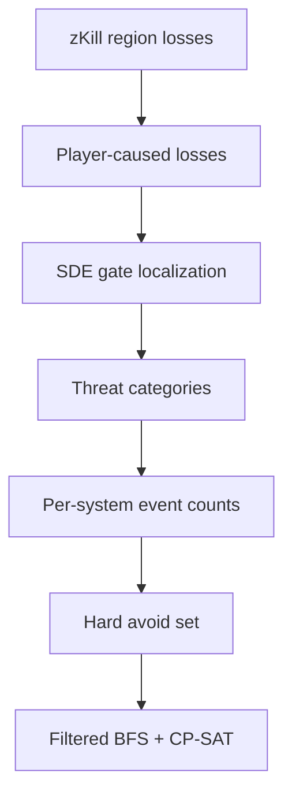

# Gate-focused threat intelligence

The optional threat policy uses recent public zKillboard killmails to remove systems with selected
gate-to-gate danger signatures. It is deliberately a transparent **hard routing policy**, not a
probability of loss and not a promise that a permitted route is safe.

The older CCP ESI system-kill aggregate remains in snapshots for compatibility and diagnostics, but
the current UI uses killmail-level zKillboard evidence. That distinction matters: an aggregate spike
cannot say whether losses happened at a gate, in a belt, at a structure, or to CONCORD.

## Data flow



The snapshot boundary is important. A solve never queries zKillboard. It consumes the exact threat
observation stored alongside the contracts, so its route policy is reproducible and fingerprinted.

## Collection contract

For every selected **threat-coverage** region, the scanner requests:

```text
GET https://zkillboard.com/api/losses/regionID/{region_id}/pastSeconds/{window_seconds}/
```

The lookback is an hourly multiple from 1 through 168 hours; the product default is **2 hours**. The
default deliberately favors recent active-threat evidence over turning an old kill into an all-day
hard avoid. A longer window remains available when the operator wants historical persistence. The
client follows zKillboard's public API guidance:

- a descriptive `User-Agent` and `Accept-Encoding: gzip`;
- at least 1.1 seconds between network requests;
- a local 15-minute response cache;
- bounded retries for HTTP 429 and server errors; and
- a trailing slash on every URL.

zKillboard documents a maximum of 1,000 killmails per request. A region returning 1,000 rows is
therefore marked **incomplete**, because an unknown number of older rows inside the requested window
may have been omitted. A failed region is also incomplete. The snapshot separately records:

- regions successfully queried;
- regions with incomplete observations;
- raw killmail rows seen; and
- retained gate events.

An incomplete observation is never interpreted as zero danger. It remains usable when the operator
chooses to accept that evidence limitation, and the incomplete region IDs are copied into the model,
plan, execution state, and problem fingerprint.

In the localhost UI, threat coverage is normally smaller than contract discovery. Before the zKill
requests, the application computes every system reachable from the route start within

$$
J_{max}=\left\lfloor\frac{H}{t_{jump}}\right\rfloor
$$

jumps under the selected stable security/manual-avoid policy, but with all dynamic threat/activity
avoids removed. It requests zKill only for the regions containing those systems. Every route that
fits the actual horizon must be inside this superset; adding the newly observed hard avoids can only
shrink it. The solver independently recomputes the same required regional envelope and refuses a
threat-aware solve if any required region has no successful observation.

The CLI exposes repeatable `scan --threat-region` for the same separation. If omitted, its backward-
compatible behavior is to use the contract regions for threat collection; a later solve will fail
explicitly if that is not enough transit coverage.

The authoritative API rules are in the
[zKillboard killmail API documentation](https://github.com/zKillboard/zKillboard/wiki/API-(Killmails)).

## Gate localization

A killmail is relevant only when the victim loss can be tied to an SDE stargate. The classifier uses
two evidence levels, in this order:

1. **Exact location:** `zkb.locationID` equals a stargate item ID in the bundled SDE and that gate is
   in the killmail's solar system. The recorded distance is zero.
2. **Victim position:** when no exact gate ID is available, the Euclidean distance from
   `victim.position` to every SDE gate in that system is measured and the nearest gate is accepted
   only when it is inside the configured radius.

The UI default is **250 km**. This is an evidence-association radius, **not** a claim about stargate
activation range. It is intentionally conservative for hauling: a ship can be physically bumped
away from its original gate position before a loss, so a very tight radius can create a false
negative for a gate-origin encounter. CCP's
[September 2019 patch notes](https://www.eveonline.com/news/view/patch-notes-for-september-2019-release)
also make the important distinction that bumping can keep a ship in pre-warp, with automatic warp
after three continuous minutes unless warp is canceled. The model does not pretend that this rule
implies one mathematically correct kill radius.

There is a corresponding false-positive tradeoff: a wider radius can associate unrelated combat on
the same grid. Smaller values are therefore reasonable for an operator who prefers stricter spatial
evidence. Exact `zkb.locationID` evidence does not depend on the radius at all. In the recorded
2026-08-06 two-hour live benchmark, all **250/250** retained gate events used exact zKill gate
location and therefore had distance zero; changing 250 km would not have changed that sample.

Losses without an exact gate or a finite victim position inside the selected fallback radius are
discarded. This is why station, belt, structure, abyssal, and most deep-space kills do not raise
route danger.

The SDE builder stores all normal stargate item IDs and three-dimensional positions specifically to
make this test deterministic.

## Player-versus-player boundary

The classifier excludes a row when zKillboard marks it `zkb.npc=true`, and it requires at least one
attacker with a character ID. This keeps pure NPC deaths--including the common loss of a criminal ship
to CONCORD--from becoming courier danger events merely because they happened near a gate.

This is intentionally conservative, but not omniscient. It depends on the fields and post-processing
present in the public zKillboard row. The retained event is evidence of a player-caused loss near a
gate, not proof about what will happen on the next transit.

## Selectable categories

One killmail may have several categories. Type-to-group mappings come from the same pinned SDE as the
route graph.

| UI category | Recorded rule | SDE group IDs |
| --- | --- | --- |
| Suicide gank | zKillboard's `ganked` label is present | not inferred locally |
| Smartbomb | at least one player attacker's weapon is in the Smart Bomb group | 72 |
| Heavy interdictor | at least one player attacker flies a Heavy Interdiction Cruiser | 894 |
| Carrier / supercarrier | at least one player attacker flies a carrier-family ship | 547, 659, 5120 |
| Multi-pilot gate camp | at least two attackers have character IDs | not type-based |
| Hauler loss | the victim ship belongs to a supported industrial/transport hauler group | 28, 380, 513, 883, 902, 941, 1202 |
| Any gate PvP | every retained player-caused gate event | not type-based |

“Suicide gank” intentionally uses zKillboard's own `ganked` label rather than reconstructing CONCORD
mechanics from incomplete public fields. “Multi-pilot gate camp” is an observable signature, not a
claim that the attackers remained on grid or controlled the gate for a particular duration.

Category overlaps count once per killmail when deriving a system threshold. Selecting both
`smartbomb` and `gate_camp` does not double-count a single smartbomb camp loss.

## Hard-avoid policy

Let:

- $E_s$ be the distinct retained gate killmails in system $s$;
- $C$ be the selected category set;
- $k$ be the configured minimum matching-event count; and
- $X$ be the explicitly exempt system set.

The forbidden set is:

$$
F(C,k,X)=\left\{s \notin X :
\left|\left\{e\in E_s : categories(e)\cap C\ne\varnothing\right\}\right|\ge k
\right\}.
$$

In plain language: forbid a non-exempt system when at least $k$ distinct observed gate losses match
one or more selected categories.

The start system is exempt so a plan can depart from its current location. During replanning, the
current system, every still-required pickup/delivery endpoint of an accepted shipment, pending
required route systems, and the stored terminal system are exempt as well. This prevents a refreshed
danger preference from making an existing execution obligation impossible by definition. Non-exempt
threat systems remain unavailable as endpoints **and transit systems**.

The solver does not subtract a risk score from reward. It first builds shortest paths on the filtered
graph, then proves the maximum gross reward possible on that declared graph. Thus the proof is exact
for the policy while the empirical quality of the policy remains a separate operator judgment.

## Audit fields

Snapshot schema 2 stores the full observation under `threat_intel`:

- source and fetch time;
- window and gate radius;
- covered/incomplete region IDs;
- raw row count; and
- every retained gate event, evidence method, distance, categories, involved type IDs, attacker
  count, and zKill labels.

Plan and execution artifacts store the selected categories, minimum count, derived system avoids,
observation settings, and coverage. Those policy fields enter `problem_sha256`; changing any of them
creates a different mathematical problem.

## Important limitations

- zKillboard is a public, third-party observation and is not guaranteed to contain every EVE
  killmail. No event means “not observed here,” not “safe.”
- A historical gate loss does not prove that a camp is still present; the lookback is a recency
  control, not a live tactical feed.
- Exact gate location or proximity does not prove that the victim was hauling, traveling through
  the gate, or attacked on the gate itself.
- Category rules are intentionally readable and deterministic. They are not a trained risk model.
- A failed zKill region has no successful coverage and therefore blocks a threat-aware solve if it
  is route-reachable. A 1,000-row saturated region is recorded as both covered and incomplete: the
  optimizer can remain mathematically exact for the observed hard-avoid set, but the real-world
  evidence limitation remains visible in the certificate.
- A hard avoid can produce long detours or make jobs unreachable. That is the requested policy
  taking effect, not a soft preference.
- Threat awareness cannot account for cargo value visibility, fit, piloting, local population,
  scouts, time of day, or attacks that have not yet occurred.

Use this feature as auditable route filtering--not as an autopilot safety guarantee.
