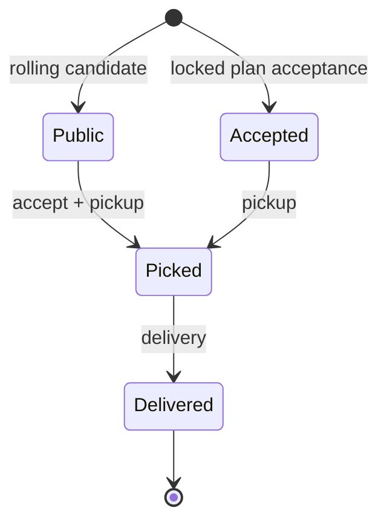

# Live replanning

Iteration 4 separates a mathematically good plan from facts that have actually happened in EVE.

## Why execution state exists

The public contract market changes continuously. Once you accept a contract, it can disappear from
the public endpoint even though its package, collateral, reward and deadline remain very real to you.
A fresh public scan alone therefore cannot represent the next optimization problem.

`ExecutionState` carries the missing commitments:

- current modeled time and solar system;
- fixed session deadline;
- cargo capacity and collateral budget;
- locked/rolling collateral mode;
- original terminal system (the original start for a loop), pending required route systems, and the
  optional simultaneous-contract limit;
- travel and routing policy (security bands, manual avoids, and optional gate-threat categories,
  threshold, observation settings, coverage, and derived avoids);
- every already accepted contract;
- whether each accepted package has been picked up; and
- its absolute modeled delivery deadline; plus
- the IDs of contracts already delivered during this execution session.

Replanning combines that state with the newest public snapshot. Active shipments are mandatory nodes
in the exact model and cannot be dropped to improve the objective.

## State transitions



The program does not infer these transitions from EVE. `advance` records an action the user confirms
really occurred.

## Locked mode

`solve --state-output execution.json` has a strong meaning in locked mode: every selected optional
contract becomes an `accepted, picked=false` mandatory commitment at the plan's time origin, with
deadline

```text
snapshot_time + days_to_complete
```

This mirrors the proof model, where all selected collateral is locked at time zero. You must actually
accept those contracts in game before relying on that state file. The CLI cannot perform acceptance
for you.

At pickup, `advance` flips the existing shipment to `picked=true`. A locked-mode pickup for a contract
that is not already in state is rejected because that would contradict the model's “accepted at time
zero” semantics.

## Rolling mode

After a rolling solve, unaccepted optional contracts do **not** become commitments merely because
they appear in the proposed future route. At the actual pickup:

1. `advance --action pickup` finds the contract in the supplied latest snapshot;
2. requires the action time to be strictly before listing expiry;
3. resolves both endpoints as supported NPC stations under the execution security policy;
4. checks currently locked collateral plus the new collateral against the budget;
5. checks current package volume plus the new volume against cargo capacity;
6. checks that adding one picked parcel respects the optional simultaneous-contract limit;
7. adds an active picked shipment with deadline `actual_accept_time + days_to_complete`.

If another player took the contract, refresh the snapshot and replan instead of recording a pickup
that never happened.

## Delivery

`advance --action delivery` requires an active picked shipment and a time no later than its modeled
deadline. It removes the commitment, releases its modeled collateral/cargo, and moves the state to
the destination system. Its contract ID moves into the completed set. If ESI still exposes that job
briefly, preprocessing records `completed_in_session` as a safe reduction rather than selecting it a
second time.

The state-transition command trusts that the user is reporting a real action. It is not a historical
anti-teleport validator; it does not try to prove that the elapsed real-world travel since the last
recorded action matched the deterministic planning model. The next solve proves feasibility forward
from the supplied current facts.

## Required route progress and original finish

Required route systems are execution facts too. `advance --action route-system --system SYSTEM`
records that a pending required system or the final system was actually reached. Pickup/delivery
actions also satisfy a required system automatically when their endpoint is that system.

A loop needs special care after the pilot moves. Suppose the original trip starts at Jita and must
return to Jita. After reaching Perimeter, a replan must not reinterpret "return to start" as "return
to Perimeter". Execution state therefore stores Jita as the original terminal. Replan constructs an
open problem from the current system with that stored terminal as a fixed finish. The same mechanism
preserves an explicitly selected non-loop finish system.

## Replan time semantics

Given state time $T_s$, snapshot observation time $T_m$, and original session end $T_e$, the
next planning time is

$$
T_0=\max(T_s,T_m)
$$

and its remaining horizon is

$$
H=T_e-T_0.
$$

If the fresh scan completed after the last action, this conservatively treats the character as having
waited at the recorded system while the market was refreshed. The original session deadline never
moves outward just because a replan happened.

### Gate-threat-policy refresh

When execution state carries enabled gate-threat categories, every replan derives the
forbidden-system set again from the supplied snapshot's newest retained gate events. Replanning
refuses to silently weaken the policy if that snapshot has no successful zKill observation.

The current system is exempt, as are the pickup (when still needed) and delivery systems of every
already accepted shipment, pending required route systems, and the stored terminal. Those exemptions
preserve the non-negotiable execution invariant: a fresh danger signal cannot make the optimizer
"solve" safety by abandoning cargo/collateral or an already-declared trip destination. All other
systems meeting the recorded category/event threshold remain unavailable as endpoints or transit.
The refreshed timestamp, window, radius,
coverage/incomplete regions, and derived set are persisted when the revised plan is armed.

The scanner preserves the prior lookback and radius during this refresh. Category selection and
minimum event count come from execution state, so a replan cannot silently change the operator's
policy. See [GATE_THREAT_MODEL.md](GATE_THREAT_MODEL.md).

## Suggested operating loop

1. `scan` immediately before planning.
2. `solve` with conservative travel/service parameters.
3. In locked mode, accept all selected contracts immediately; then treat the emitted state as live.
4. Execute the next pickup/delivery in EVE.
5. `advance` that action, or a required route-system milestone, into a new state file.
6. Refresh `scan` whenever public availability matters.
7. `replan` from the newest state/snapshot.
8. Repeat through delivery of all mandatory shipments.

If a replan returns `proven_infeasible`, it means the remaining mandatory state cannot fit the
remaining horizon/policy. It does not destroy execution state. Record any real progress and replan
again. If there are no accepted courier commitments, the localhost UI offers **End execution & start
new plan** so the trip can be closed without the stronger warning used when commitments remain.

The localhost application persists that live state across program restarts. A restored session is
shown with a permanent **Live route** top-bar indicator and execution banner, including a direct
resume action and an explanation of why fresh planning is locked. When no accepted commitments
remain, the banner can safely end the restored session and release that lock. If the saved planning
horizon has expired while commitments still exist, the UI warns about the expired horizon but keeps
the commitments until the operator records progress or deliberately resets them.

Keep old JSON files if auditability matters. They are deterministic records of which market
observation and state led to each plan, and every plan includes a problem fingerprint.

## Authenticated conveniences remain optional

The localhost UI itself needs no EVE SSO. A later enhancement could use authenticated scopes for
conveniences such as checking character location or setting waypoints. Those features are
intentionally orthogonal to optimization: public contract discovery needs no OAuth credentials, and
authentication should never change what constitutes an optimal mathematical route.
