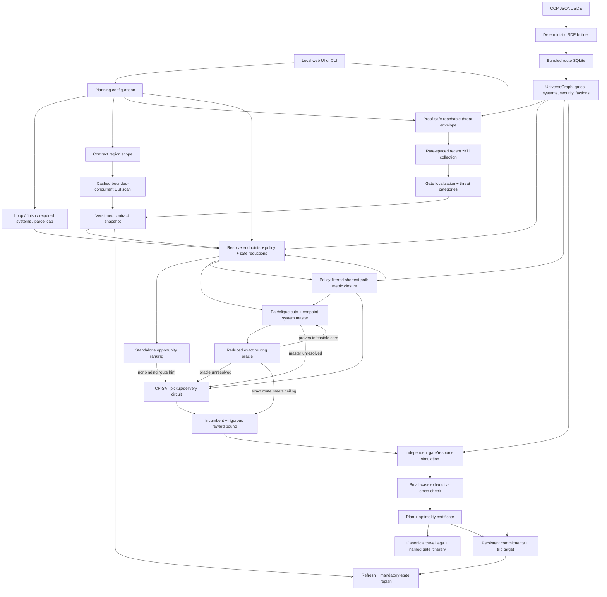

# Contributor technical overview

This page is the shortest path through the implementation for a developer who has not seen the
project before. The boxes are process boundaries or durable artifacts; arrows are real data/control
dependencies, not just conceptual associations.

## Core feature map

The dashed ranking arrow is deliberate. Ranking estimates a contract's standalone economics and
provides a constructive starting hint; it does **not** define the CP-SAT objective and does not
remove candidates unless the operator explicitly requests the heuristic candidate cap. Clusters of
short jobs, shared travel, interleaved pickups, cargo, collateral and deadlines are handled by the
joint solver.

## What each layer guarantees

| Layer | Main code | Invariant that later layers rely on |
| --- | --- | --- |
| Static universe | `sde_build.py`, `sde.py` | one identified SDE build; normal gates form the routing graph; region faction/security metadata drives acquisition presets |
| Live acquisition | `esi.py`, `scanner.py`, `threat_intel.py` | market and danger observations are frozen before optimization; incomplete threat coverage is explicit |
| Domain boundary | `domain.py`, `snapshot.py` | ISK/cargo are exact integers; loop/final/required-system and parcel-count semantics are explicit; timestamps are timezone-aware; JSON artifacts are versioned |
| Preparation | `planning.py` | endpoint/security/threat exclusions are declared; only proof-preserving reductions are silent; any heuristic cap is recorded |
| Routing | `sde.py` | shortest paths and jump counts are computed on the same security/manual/threat-filtered graph used by verification |
| Bound strengthening | `bounds.py` | optimistic two-contract projections and the system master create only necessary cuts/ceilings; every exact route remains representable; proven exact cores become safe no-goods |
| Optimization | `solver.py` | dense cases first try master-guided reduced exact routing; unresolved cases retain a complete reward-maximizing pickup/delivery circuit fallback with exact terminal and resource constraints |
| Independent checks | `verification.py`, `reference_solver.py` | extracted contract/waypoint/final travel is resimulated without trusting CP-SAT state variables; small supported locked cases get a separate exhaustive optimum |
| Reporting | `proof.py`, `reporting.py`, `webapp.py` | certificate records bound/gap/model hash; web decoration adds names but cannot change route semantics |
| Pilot execution | `execution.py` | accepted jobs become mandatory state; original terminal/remaining waypoints/parcel cap persist; completed IDs cannot be rewarded again; replanning starts from what really happened |

## End-to-end threat-aware routing

Threat awareness is not an endpoint filter. A selected threat category becomes a set of avoided
system IDs inside `SecurityPolicy`. Both the metric closure used by CP-SAT and the independent
`shortest_path()` calls used by verification traverse that filtered graph. Consequently every
intermediate system in the web itinerary--not only pickup and delivery systems--satisfied the recorded
security/manual/threat policy when the plan was solved.

`travel_legs` in `plan.json` is the canonical physical itinerary. It covers action legs, required
waypoints, and the final loop return/fixed destination, each with a `jump_path`. The local web layer
resolves those IDs back through the pinned SDE and exposes `jump_path_systems` with names, security
status and security band. The browser only renders these values; it never invents a route. This is
why a zero-cargo, zero-contract solve can still function as a route finder.

## Optimality path

The proof has three distinct questions:

1. **Was the candidate universe honest?** `planning.py` records policy exclusions and any heuristic
   reduction. ESI itself is a live, non-transactional observation, so the theorem is relative to the
   recorded snapshot and scanned regions.
2. **Did the optimizer close the reward bound?** On dense cases `bounds.py` first supplies a rigorous
   ceiling from a deliberately easier system-level master. If that master is optimal and its chosen
   contract set has an independently verified exact route at the same reward, lower and upper bounds
   are equal and the composite proof closes immediately. Proven-infeasible exact assumption cores
   safely cut the master and retry. Otherwise the full exact CP-SAT fallback must close its own
   integer objective bound. Running longer is not a substitute for either kind of bound equality.
3. **Is the extracted route actually feasible?** `verification.py` reconstructs every stargate path
   and replays time, cargo, parcel count, terminal/required-system rules, collateral, precedence and
   reward. A disagreement is fatal. For small
   locked problems the exhaustive reference solver additionally checks the optimum itself.

Read [MATHEMATICAL_MODEL.md](MATHEMATICAL_MODEL.md) for the equations,
[CP_SAT_GUIDE.md](CP_SAT_GUIDE.md) for how OR-Tools searches/proves, and
[OPTIMALITY.md](OPTIMALITY.md) for the exact scope of the theorem.

## Safe places to extend the project

- New live data belongs before the snapshot boundary; do not query moving APIs from `solver.py`.
- A new routing restriction belongs in `SecurityPolicy`/`UniverseGraph` and must also be consumed by
  independent verification.
- A performance reduction may be called proof-preserving only if it cannot remove a feasible route.
  Heuristics are allowed, but must visibly truncate the certificate scope.
- UI convenience data should decorate canonical IDs/results; browser code must not reimplement
  mathematical feasibility.
- Any new accepted-contract behavior must round-trip through `execution.py`, because replanning is
  required to preserve real commitments rather than merely the previous suggestion.
